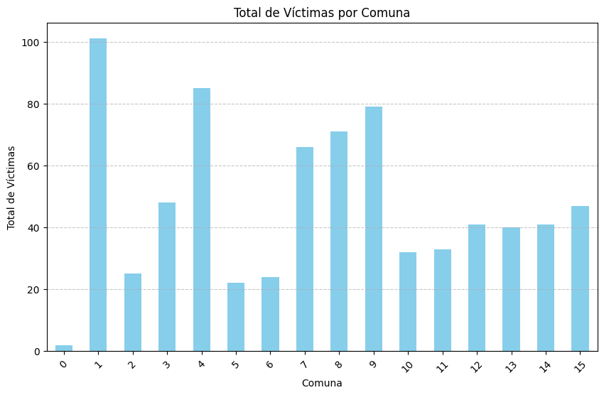
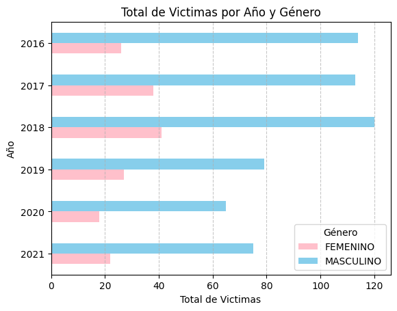
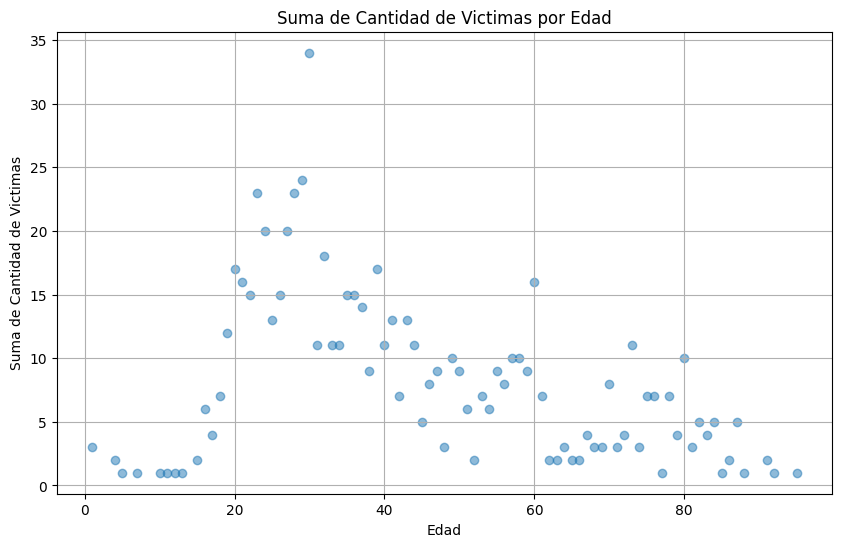

# <h1 align=center> <strong> **PROYECTO INDIVIDUAL Nº2** </strong> </h1>

# <h2 align="center"> **Siniestros Viales de la ciudad de Buenos Aires** </h2>

## **`Índice`**
- [Introducción ](#introducción-)
- [Contenido del repositorio ](#contenido-del-repositorio-)
- [Información de los datos ](#información-de-los-datos-)
- [Propuesta de trabajo ](#propuesta-de-trabajo-)
- [ETL - EDA ](#etl---eda-)
- [Resultado ](#resultado-)
- [Conclusión](#conclusión-)
- [Herramientas ](#herramientas-)
- [Elaborador ](#elaborador-)

## **`Introducción`** 

Bienvenidos al proyecto 2 correspondiente a la etapa de Lab's de la carrera **Data Science** de **Henry**, donde nuestro rol asignado para esta ocasion es de **Data Analyst** en la Secretaria de Transporte de la ciudad de Buenos Aires. 

Nuestro rol es analizar en profundidad los datos otorgados para mejorar asi la calidad de vida de los ciudadanos a traves de la seguridad vial.

  

## **`Contenido del repositorio`** 

* Encontraran los dataset siendo dos archivos:
> * *siniestros* : Datos limpios que se obtuvieron luego del proceso del ETL, con unión de hojas a traves de columnas y correción de tipográficos.
* Encontraran la carpeta **src** donde estan las imagenes utilizadas en el presente REAME.
* En archivo **ETL** encontraran toda la documentación y el paso a paso de lo que se trabajo hasta llegar a un CSV. En archivo **EDA** encontrara toda la documentación y el paso a paso de lo analizado para trabajar en el dashboard.
* **Dashboard** contiene el analisis de visualizacion y KPIs requeridos.

## **`Información de los datos`** 
Los datos entregados para trabajar fue 1 que contenia dos hojas de calculo en un formato XLSX.

* "homicidos.xlsx"
> * Datasets entegados: [Enlace de los datasets](https://docs.google.com/spreadsheets/d/1nq00jGIZHQ1RLSET43zKnUsMsoFb-pBg/edit#gid=1625530738)

## **`Propuesta de trabajo`** 

En este repositorio se aborda la problemática de los siniestros viales en la ciudad de Buenos Aires durante el período entre los años 2016 y 2021. Se examinan los datos recopilados durante los mismos para identificar patrones, tendencias y desafíos asociados con los accidentes de tránsito en la ciudad.

Se espera obtener una comprensión detallada de la problemática de los siniestros viales en Buenos Aires, así como identificar áreas de intervención y desarrollar recomendaciones para mejorar la seguridad vial en la ciudad. Los resultados se presentarán a través de visualizaciones de datos que serán compartidos en este repositorio.

## **`ETL - EDA`** 

- Revisión, manejo y eliminación de nulos.
- Transformaciones de datos en columnas.
- Eliminación de columnas innecesarias.
- Exportación de los datos transformados a un nuevo CSV.
- Creación de gráficos para llegar a un análisis más profundo.

## **`Resultado`** 

En el siguiente gráfico podremos observar el total de víctimas durante el perídios 2016 y 2021. Obteniendo las comunas más afectadas en cuanto a siniestros nos referimos. Siendo la comuna 1 la más afectada entre las demás marcando por encima de 100 víctimas, la comuna 4 teniendo una breve diferencia con la comuna anterior teniendo víctimas por encima de 80 y por último la comuna 9 teniendo una ligera diferencia con la comuna 4.

  

En el siguiente gráfico podremos observar el total de víctimas por año separandolo por género. En él vemos una gran diferencia si pensamos en el género que está más involucado en incidentes. El género masculino tiene una diferencia significativa en nuestros períodos de años más incidentes que el género femenino. Siendo el 2018 el que más incidentes tiene con este género, observando que en los posteriores años reducieron significativamente.

  

En el siguiente gráfico podremos observar la cantidad de víctimas totales por edad. Observamos que las víctimas más comúnes se encuentran en el rango de 20 a 40 años por lo que podríamos pensar que los jóvenes adultos son más propensos a estar involucrados en incidentes.

  

## **`Conclusión`** 

* Dado que observamos una concentracion de siniestros en ciertos meses del año, se podria implementar una mayor vigilancia y concientizacion durante estos periodos. Esto podria incluir campañas de seguridad vial y un refuerzo policial en las calles que presentan un mayor numero de accidentes.
* Pensando que la mayoria de los involucrados se encuentran en el rango de edad entre 20 y 40 años, se podrian crear programas de educacion vial dirigidos a este grupo. Estos programas podrian centrarse en concientizar sobre los riesgos de conducir bajo los efectos del alcohol, el exceso de velocidad y otras conductas peligrosas.
* Dado que observamos una distribucion desigual entre diferentes comunas de la ciudad, se podria priorizar la implementacion de medidas sobre seguridad vial en las comunas con un mayor numero de accidentes. Esto podria incluir la mejora de la infraestructura vial, como la de mas señalizaciones y semaforos.
* Dado que las motocicletas son el tipo de vehiculo mas comunmente involucrado en siniestros, se podrian implementar medidas especificas para mejorar la seguridad de los motociclistas, como campañas sobre el uso del casco y el respeto de las normas de transito.

## **`Herramientas`** 

- Pandas
- Numpy
- Matplotlib
- Seaborn
- Power BI

## **`Elaborador`** 

* Brenda Romero

>> Linkedin : https://www.linkedin.com/in/brenda-romerok/